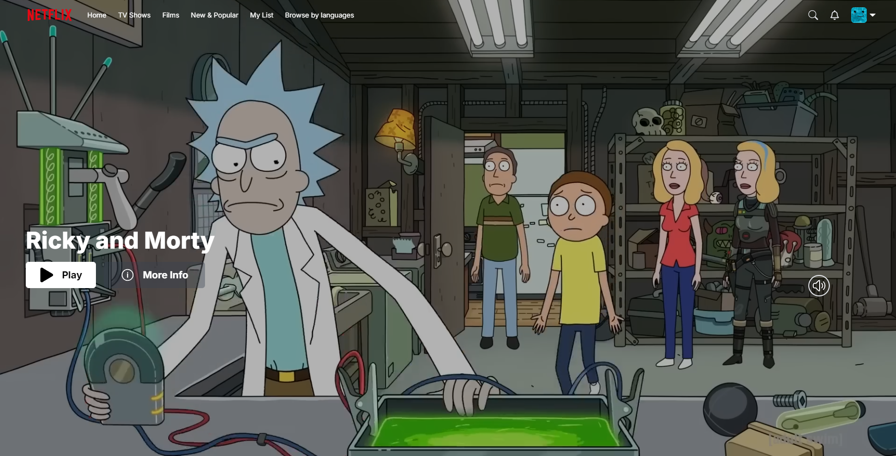
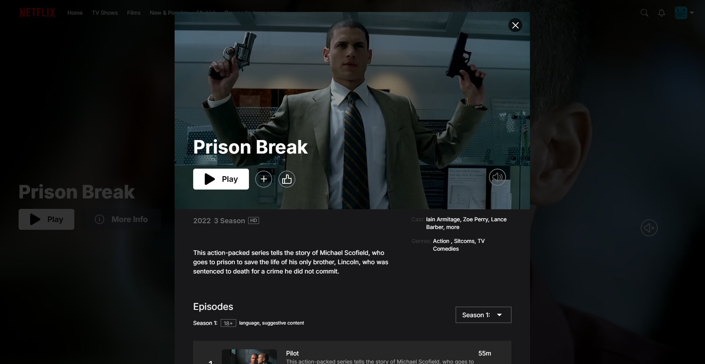
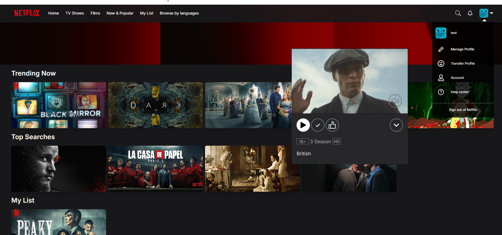
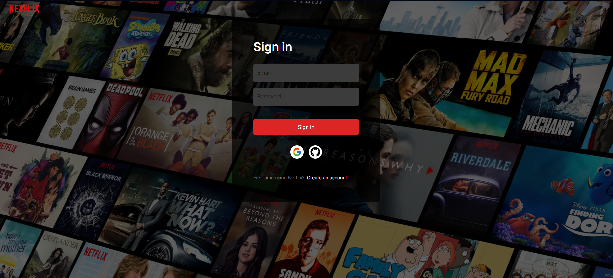
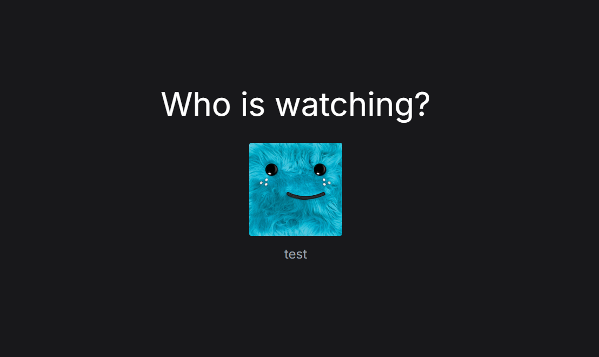
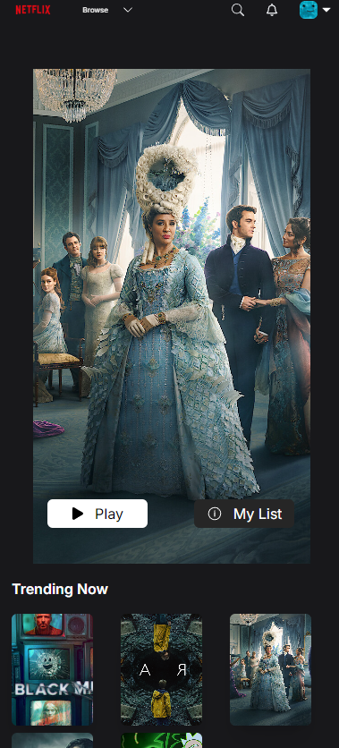

# Netflix Clone 🎬📺


Netflix Clone is a web application that replicates the functionality and design of Netflix, allowing users to browse and stream movies and TV shows.

  ## Demo  🌐
 [netflix-clone](https://netflix-clone-woad-phi.vercel.app/) 

## Screenshots 📸
<div>
    <h3>Billboard 🎥</h3>
    
</div>
<div style="display: flex; flex-direction: row;">
  <h3>Info Modal 🔍</h3>
    
  <h3>Movie Card 🎬</h3>
    
</div>
<div style="display: flex; flex-direction: row;">
  <h3>Login Page 🔐</h3>
    
  <h3>Profiles Page 👤<h3>
   
</div>
<div>
  <h3>Mobil Screen 👤<h3>
   
</div>


## Features ✨

- **🎬 Movie & TV Show Browsing:** Users can browse through a large library of movies and TV shows. 
 for each transaction.
- **⭐ Favorites:** Users can add movies and TV shows to their favorites for easy access later.
- **👤User Profiles:** Create and manage user profiles.
- **🎥 Video Playback Controls:** Includes play, pause, skip, and volume controls.
- **🖼️ Responsive Design:** Adaptable interface that works on different screen sizes.

## Technologies Used 💻

- 🗃️ [Zustand](https://zustand-demo.pmnd.rs) - State management library.
- 📦 [Next.js](https://nextjs.org) - React framework for server-side rendering and static site generation.
- 💻 [React.js](https://reactjs.org/) - JS library for crafting user interfaces
- ⚡ [Vite](https://vitejs.dev/) - Module bundler
- 🎨 [Tailwind CSS](https://tailwindcss.com/) - A utility-first CSS framework
- ⚙️ [Material-UI (MUI)](https://mui.com) - React components for faster and easier web development.
- 🛤️ [NextAuth.js](https://next-auth.js.org) - Authentication for Next.js applications.
- 📄 [SWR](https://swr.vercel.app) - React Hooks library for data fetching.
- 🌐 [Lodash](https://lodash.com) - JavaScript utility library for working with arrays, objects, and other data types.
- 🖼️ [React Icons](https://react-icons.github.io/react-icons/) - A library of popular icons for React applications
- 🌐 [Vercel](https://vercel.com/) - Hosting platform for deploying Next.js applications.

 ### Database 🗃️
- 🛢️ [Prisma](https://www.prisma.io/) - Prisma ORM is an open-source next-generation ORM
- ☘️ [MongoDB Atlas Cloud Database](https://www.mongodb.com/products/platform/cloud) - Cloud-based NoSQL database for storing and managing data.

## Installation 🛠️

Prerequisites

- Install Node.js ⚙️
- Clone the repo 🔄

 📦 After cloning the repo install dependecies with
 ```sh 

   npm install

```

### Setting Up the .env File ⚙️

1. **Cloning the Project:** 🔄
   - Once you've cloned the project, you'll need to create a `.env` file.
   - I've included an .env.example file with detailed instructions on which environment variables the project requires and how to set them up.
    
2. **Creating the .env File:** ⚙️
   - Start by copying the `.env.example` file and creating a new file named `.env`.
   - Make sure to fill in the contents of the `.env` file.

3. **Defining Environment Variables:** 🔧
  - In the .env file, you need to define the following environment variables to set up authentication with Google and GitHub using NextAuth.js:.

 ```sh 

   # Google OAuth credentials
      GOOGLE_CLIENT_ID=your_google_client_id
      GOOGLE_CLIENT_SECRET=your_google_client_secret

   # GitHub OAuth credentials
      GITHUB_ID=your_github_client_id
      GITHUB_SECRET=your_github_client_secret

   # NextAuth.js secrets
      NEXTAUTH_SECRET=your_nextauth_secret
      NEXTAUTH_JWT_SECRET=your_nextauth_jwt_secret


```

4. **Generating OAuth Credentials:** 🔑
- For Google:
  - Go to the [Google Cloud Console](https://console.cloud.google.com/welcome/new?project=metal-force-433208-a0NB).
  - Create a new project or select an existing project.
  - Navigate to APIs & Services > Credentials.
  - Click on Create Credentials and select OAuth 2.0 Client IDs.
  - Configure the OAuth consent screen and set up the credentials.
  - Copy the `Client ID` and `Client Secret` and add them to your `.env` file.

- For Github:
  - Go to [GitHub Developer Settings](https://github.com/settings/developers).
  - Click on New OAuth App.
  - Fill in the required information and create the app.
  - Copy the `Client ID` and `Client Secret` and add them to your `.env` file.

5. **Generating NextAuth.js Secrets
:**
- NEXTAUTH_SECRET: This secret is used to encrypt the session and JWT tokens. You can generate a secure random string using a tool like openssl or uuid:


 ```sh 

    openssl rand -base64 32

```
- NEXTAUTH_JWT_SECRET: This secret is used for signing JWT tokens. You can use the same method as `NEXTAUTH_SECRET` to generate a secure string.

6.Completing Setup: ✅

- Once you have generated and added all the necessary credentials and secrets to the .env file, you are ready to start the application.


## License 📄

[MIT](https://choosealicense.com/licenses/mit/)
